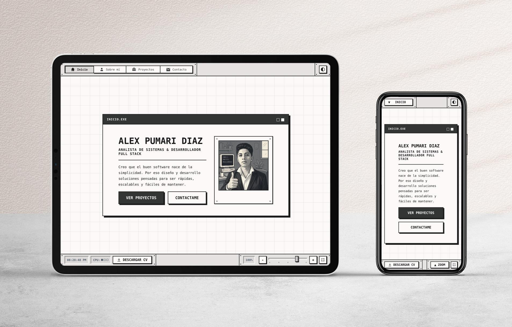

# Portafolio web personal




Un portafolio web interactivo con una estética retro inspirada en el pixel art. Desarrollado con React, TypeScript, Sass y JavaScript para crear una experiencia visual dinámica y personalizada.

<div align="center">
  <a href="https://youtu.be/RaP0u8aqNzc" target="_blank">
    
  </a>
  <a href="https://www.alex-pumari.com.ar/" target="_blank">
    
  </a>
</div>

<br>

## Cosas que aprendí

* Bases de React y creación de componentes con JSX para construir interfaces dinámicas.
* Manejo de estado y props para controlar el comportamiento de los componentes.
* Uso de Sass para organizar estilos mediante variables, anidación y mixins.
* Limitaciones de Sass en proyectos complejos y la importancia de utilizar soluciones más escalables.
* Bases de Docker y contenerización de aplicaciones.
* TypeScript, interfaces y uso de TSX para desarrollar aplicaciones React con tipado estático.
* Testing unitario para validar el comportamiento de la aplicación.
* Storybook para desarrollar y documentar componentes de forma aislada.
* Conceptos básicos de CI/CD mediante GitHub Actions para automatizar procesos.
* Bases sobre agentes de IA, skills y herramientas como OpenCode.

## Estructura del Proyecto

```text
react-portfolio/
├── public/
│   └── favicons/             # Conjunto de Favicons
├── src/
│   ├── adapters/             # Adaptadores de información
│   ├── assets/               # Imágenes y PDFs
│   ├── components/           # Componentes de React
│   ├── config/               # Ajustes y constantes
│   ├── contexts/             # Contextos de React
│   ├── hooks/                # Custom Hooks de React
│   ├── layout/               # Header, Footer y el switch de vistas
│   ├── logic/                # Lógica de negocio
│   ├── services/             # Servicios de datos
│   ├── styles/               # Estilos y configuraciones
│   ├── types/                # Tipos compartidos
│   ├── use-cases/            # Casos de uso
│   ├── views/                # Vistas (home, about-me, projects, contact)
│   ├── app.tsx
│   └── main.tsx
└── README.md
```

## Instalación

### Requisitos previos

* Node.js 18+
* npm o yarn

### 1. Clonar este repositorio

```bash
git clone https://github.com/AlexRubenPumari/react-portfolio.git
cd react-portfolio
```

### 2. Instalar dependencias

```bash
npm install
```

---

## Ejecutando el proyecto

### Inicializar el Servidor de Desarrollo

```bash
npm run dev
```

El servidor se aloja por defecto en:

`http://localhost:5173`

### Inicializar el Servidor de Desarrollo fuera del contenedor

```bash
npm run dev:container
```

El servidor se aloja por defecto en:

`http://localhost:5173`

### Inicializar Storybook

```bash
npm run storybook
```

Storybook se aloja en:

`http://localhost:6006`
